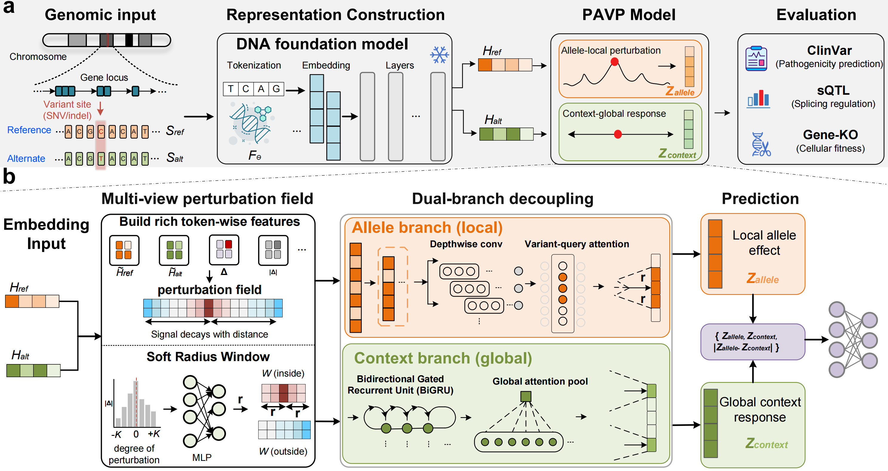

# PAVR

> **PAVR: Perturbation-Aware Variant Representations from Genomic Foundation Models**

<p align="center">
  
</p>

Variant effect prediction asks whether a small DNA change can perturb molecular function and alter phenotype. Genomic foundation models (GFMs) provide strong sequence representations, but effects span **local allelic disruption**, **proximal regulatory response**, and **distal functional consequences**. Collapsing these into one global embedding can wash out variant-specific signal and entangle distinct effect scales.

**PAVR** (*Perturbation-Aware Variant Representation*) repurposes **frozen** GFMs by comparing token-level hidden states of paired reference and alternative sequences. It builds multi-view ref–alt token fields and uses an explicit **dual-branch** design with soft complementary receptive fields:

- **Allele branch** — local allelic perturbation at the edited bases  
- **Context branch** — context-mediated / regulatory response (BiGRU)

The two scales stay disentangled before fusion, improving predictive performance and mechanistic interpretability over conventional global differential embeddings (validated on ClinVar, sQTL, and Gene-KO across six GFMs).

This repository is a self-contained demo of the **paper-default PAVR** (no ablation switches). Evo2 weights and the GFM encoding pipeline are not included; features are assumed cached offline.

---

## Layout

```
PAVR/
├── script/
│   ├── train.py           # ClinVar 4-class trainer
│   ├── common/            # layers + task losses
│   └── pavr/
│       └── model.py       # PAVR adapter (paper default)
├── data/
│   ├── PAVR.png                     # method overview figure
│   ├── clinvar_pathogenicity.csv
│   ├── dataset_summary.json
│   └── evo2_7b_window_gastric_1k.pt   # ~2 GB frozen Evo2-7B cache
├── result/window_gastric_1k_Evo2_7B/  # 5-seed demo (AUROC ≈ 0.862)
├── environment.yml
├── environment.full.yml
├── requirements.txt
└── README.md
```

---

## Demo data

Test data (including the cached feature tensors) is hosted on Hugging Face:  
[https://huggingface.co/datasets/xw97/PAVR_test_data](https://huggingface.co/datasets/xw97/PAVR_test_data)

| File | Content |
|------|---------|
| `data/clinvar_pathogenicity.csv` | 2000 gastric ClinVar variants, 1 kb windows |
| `data/evo2_7b_window_gastric_1k.pt` | Cached tensors: `h_ref`, `h_alt`, `variant_mask`, `padding_mask` |

Splits: train 1400 / val 300 / test 300.

> The `.pt` cache is ~2 GB and is gitignored by default. Download it from the Hugging Face dataset above, or use Git LFS / a release asset.

---

## Reported result

`result/window_gastric_1k_Evo2_7B/` (PAVR + frozen Evo2-7B, 5 seeds):

| Metric | Mean ± std |
|--------|------------|
| Macro AUROC | **0.862 ± 0.018** |
| Macro F1 | 0.519 ± 0.044 |

---

## Environment

```bash
conda env create -f environment.yml
conda activate pavr
```

`environment.full.yml` is a full dump of the authors’ `Genomic` env (optional).

---

## Train

```bash
cd PAVR
export PYTHONPATH=script

python script/train.py \
  --features data/evo2_7b_window_gastric_1k.pt \
  --csv data/clinvar_pathogenicity.csv \
  --output-dir result/rerun_window_gastric_1k \
  --seeds 0 1 2 3 4 \
  --device cuda
```

```bash
PYTHONPATH=script python -c "from pavr import PAVRClassifier, PAVRConfig; print('ok')"
```

---

## License & contact

No license file is included in this repository. Please confirm licensing with the project owner before reuse or redistribution.
